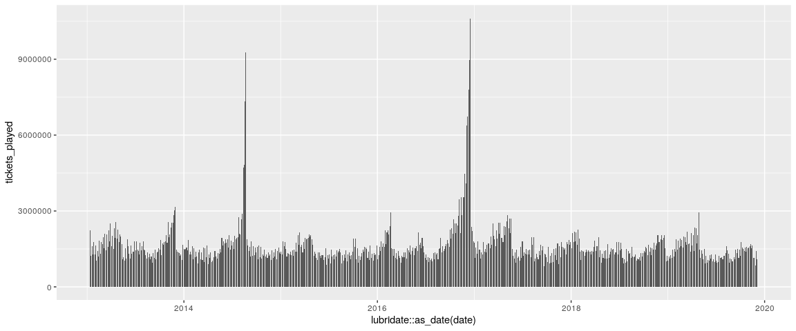
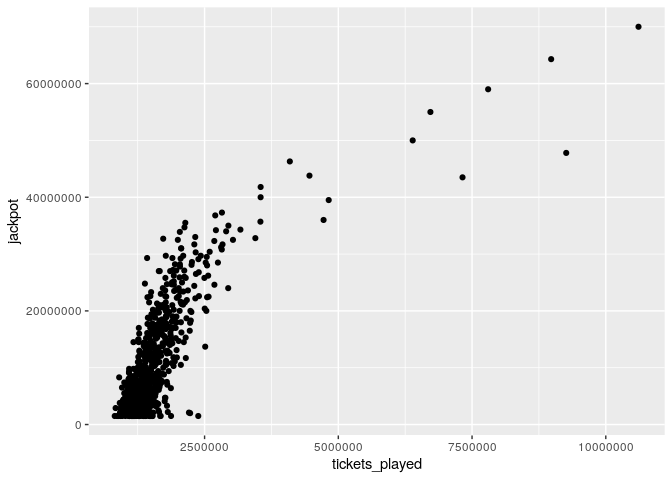
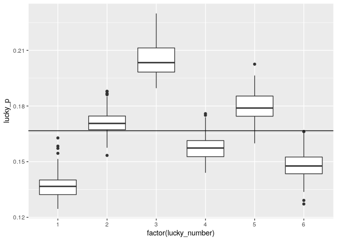
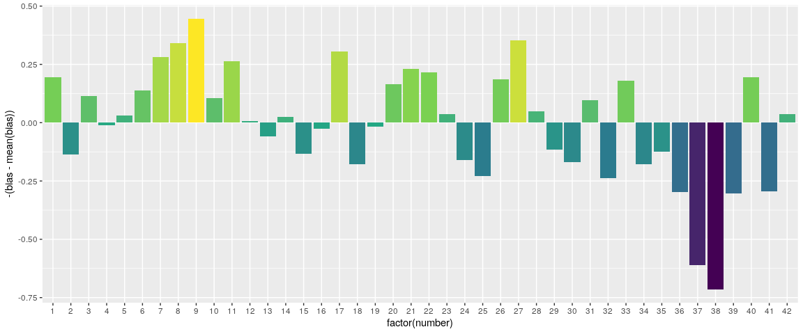

A superstitious person may believe they are more likely to win the lottery by playing their lucky numbers. They believe there is a greater chance that their chosen numbers will be drawn. 

Of course, unless the lottery is rigged, that is not the case. Most will 
realize that every number and every combination of numbers has the same likelihood. However - and this is the exciting part - not every combination has the same expected value.

Our idea is this: Because some people are superstitious, and humans are bad at picking numbers randomly, there will be numbers that gamblers play much more frequently than other numbers. If we can play the numbers that other people are least likely to play, we expect to win more money because if we do actually win, the pot will be split among fewer people. 

So, it is true that some numbers will make more money in the long run. By making more money, we mean you'd lose money at a slower rate than the average lottery player; you'd still lose money.

## Data Overview and Analysis Tools

We analyze approximately seven years of lottery drawings (n = 720, start = 2013-01-12, end = 2019-12-04) from "Swisslos," the national lottery of Switzerland, using the statistical programming language R, and we use GridDB for our data storage.


```r
# Required packages RJDBC and tidyverse 
# griddb is the connection object to our GridDB

drv <- JDBC(
  driverClass = "com.toshiba.mwcloud.gs.sql.Driver",
  # Point this to your gridstore jar
  classPath = "/jdbc/bin/gridstore-jdbc.jar"
)

# IP and port depend on your setup
griddb <- dbConnect(
  drv, 
  "jdbc:gs://172.20.0.42:20001/dockerGridDB/public", 
  "admin", 
  "admin"
)

# vectorized insert function
dbInsertTable <- function(conn, name, df, append = TRUE) {
  for (i in seq_len(nrow(df))) {
    dbWriteTable(conn, name, df[i, ], append = append)
  }
}

dbSendUpdate(griddb, paste(
  "CREATE TABLE IF NOT EXISTS swisslos_jackpots", 
  "(date STRING, jackpot INTEGER);"
))
dbInsertTable(griddb, "swisslos_jackpots", read_csv("data/swisslos_jackpots.csv"))


dbSendUpdate(griddb, paste(
  "CREATE TABLE IF NOT EXISTS swisslos_payouts", 
  "(combination STRING, winners INTEGER, prize FLOAT, date STRING);"
))
dbInsertTable(griddb, "swisslos_payouts", read_csv("data/swisslos_payouts.csv"))


dbSendUpdate(griddb, paste(
  "CREATE TABLE IF NOT EXISTS swisslos_numbers", 
  "(type STRING, number INTEGER, date STRING);"  
))
dbInsertTable(griddb, "swisslos_numbers", read_csv("data/swisslos_numbers.csv"))
```


```r
dbListTables(griddb)
```

```
## [1] "swisslos_jackpots" "swisslos_numbers"  "swisslos_payouts"
```

  
  * Jackpot sizes (swisslos_jackpots)
    1. date
    2. jackpot: maximum payout (CHF) for 6 + 1
  * Drawn numbers (swisslos_numbers)
    1. type (normal, lucky, replay)
    2. number
    3. date
  * Payout per category correct (swisslos_payouts)
    1. combination: normal + lucky (for example, 3 + 1 => three regular correct and lucky number correct)
    2. winners: number of winning tickets
    3. prize: payout (CHF) per winner
    4. date


```r
# stringr::str_interp is a handy function to parameterize SQL queries from R
# just be careful; SQL injections happen.
show_date <- function(conn, table, date = "2013-02-13") {
  dbGetQuery(conn, str_interp("SELECT * FROM ${table} WHERE date = '${date}';"))
} 

map(dbListTables(griddb), ~ show_date(griddb, .))
```

```
## [[1]]
##         date jackpot
## 1 2013-02-13 8600000
## 
## [[2]]
##     type number       date
## 1 normal     13 2013-02-13
## 2 normal     21 2013-02-13
## 3 normal     25 2013-02-13
## 4 normal     26 2013-02-13
## 5 normal     32 2013-02-13
## 6 normal     40 2013-02-13
## 7  lucky      1 2013-02-13
## 8 replay     13 2013-02-13
## 
## [[3]]
##   combination winners   prize       date
## 1       6 + 1       0    0.00 2013-02-13
## 2           6       0    0.00 2013-02-13
## 3       5 + 1       6 7570.15 2013-02-13
## 4           5      36 1000.00 2013-02-13
## 5       4 + 1     283  208.90 2013-02-13
## 6           4    1690   87.35 2013-02-13
## 7       3 + 1    4681   31.85 2013-02-13
## 8           3   28264   10.55 2013-02-13
```

## Swisslos rules and probabilities

To play Swisslos, you choose six numbers between 1 and 42 and a single _Lucky Number_ between 1 and 6. 


```r
regular_numbers <- 42
regular_draws   <- 6
lucky_numbers   <- 6
lucky_draws     <- 1
```

We can compute the number of possible combinations as follows. Of course, the _Lucky Number_ increases the number of combinations by a factor of six.


```r
# Binomial coefficient function
# Bin(a, b)
bin <- function(a, b) {
  map2_dbl(a, b, function(.a, .b) {
    if (.b == 0 | .a == .b) {
      1
    } else {
      .c <- .a - .b + 1
      prod(.c:.a) / prod(1:.b)
    }
  })
}

# 42 choose 6
swisslos_regular_combos <- bin(regular_numbers, regular_draws)
```

There are 5245786 ways to choose six from 42, factoring in the _Lucky Number_ there are 31474716 combinations. Similarly, we can calculate the combinations of three, four, and five with or without the lucky number. 

So, we can calculate the probabilities.


```r
# probability to get n correct
swisslos_prob <- function(n) {
  n_match <- bin(regular_draws, n)
  n_miss <-  bin(regular_numbers - regular_draws, regular_draws - n)
  n_miss * n_match  / swisslos_regular_combos
} 

# We can check correctness with sum(swisslos_prob(0:6)) == 1, which yield true

tibble(n_correct = 0:6) %>% 
  mutate(
    prob_base  = swisslos_prob(n_correct),
    prob_lucky = prob_base / 6,
    prob_not_lucky = prob_base - prob_lucky
  ) %>% 
  knitr::kable(digits = 8)
```


| n_correct|  prob_base| prob_lucky| prob_not_lucky|
|---------:|----------:|----------:|--------------:|
|         0| 0.37130603| 0.06188434|     0.30942170|
|         1| 0.43119411| 0.07186568|     0.35932842|
|         2| 0.16843520| 0.02807253|     0.14036266|
|         3| 0.02722185| 0.00453698|     0.02268488|
|         4| 0.00180145| 0.00030024|     0.00150120|
|         5| 0.00004118| 0.00000686|     0.00003431|
|         6| 0.00000019| 0.00000003|     0.00000016|

Funny note: It's more likely to get one right (~43%) than none (~37%). It's counter-intuitve and parallel to the [birthday paradox](https://en.wikipedia.org/wiki/Birthday_problem).

## Analysis

### How many people play Swisslos every week?

Given that chance to get three out of six is 2.72%, we can estimate the number of people that play Swisslos (actually, we estimate the number of played tickets).


```r
# To retrieve the data from GridDB we type a SQL query
# Computing the result with SQL makes it unnecessary to pull the entire table
# into R

# paste makes it easy to type long SQL and break it up into multiple lines

# we make n a parameter because you could use 4 instead of 3 but 3 gets greater
# counts so we will stick with that
get_n_correct <- function(conn, n) {
  q <- paste(
    "SELECT SUM(winners) AS winners, date",
    "FROM swisslos_payouts",
    "WHERE combination = '${n}'  OR combination = '${n} + 1'",
    "GROUP BY date",
    "ORDER BY date;"
  )
  dbGetQuery(conn, str_interp(q))
}
  
three_correct <- get_n_correct(griddb, 3) %>% 
  mutate(tickets_played = winners / swisslos_prob(3)) %>% 
  as_tibble()
  
three_correct %>% head(5)
```

```
## # A tibble: 5 × 3
##   winners date       tickets_played
##     <dbl> <chr>               <dbl>
## 1   60705 2013-01-12       2230010.
## 2   33745 2013-01-16       1239629.
## 3   43457 2013-01-19       1596401.
## 4   35013 2013-01-23       1286209.
## 5   48120 2013-01-26       1767698.
```

We can now plot the number of tickets that have been played over time, 


```r
three_correct %>% 
  ggplot(aes(x = lubridate::as_date(date), y = tickets_played)) + 
  geom_col()
```

<!-- -->

but maybe more interestingly, we can plot the number of tickets against the jackpot.


```r
# You can test your SQL here, but because we need to get the entire 
# swisslos_jackpots table, we might just as well join it in R
three_correct_jp <- three_correct %>% 
  left_join(dbGetQuery(griddb, "SELECT * FROM swisslos_jackpots;"), by = "date")

three_correct_jp %>% 
  ggplot(aes(x = tickets_played, y = jackpot)) +
  geom_point()
```

<!-- -->

We can clearly see a positive correlation between jackpot size and the number of tickets played.


```r
cor.test(three_correct_jp$tickets_played, three_correct_jp$jackpot)
```

```
## 
## 	Pearson's product-moment correlation
## 
## data:  three_correct_jp$tickets_played and three_correct_jp$jackpot
## t = 33.147, df = 718, p-value < 0.00000000000000022
## alternative hypothesis: true correlation is not equal to 0
## 95 percent confidence interval:
##  0.7470597 0.8050008
## sample estimates:
##       cor 
## 0.7776764
```

(To answer this question in a simple manner, we assumed that people play their 6 out 42 completely randomly. They don't; but the effect should be small enough to not interfere with our ability to gauge the number of players.)

### Which is the most frequently played Lucky Number?

To find the most frequently played _Lucky Number_, we compare the counts of the winning combinations of three out of six without _Lucky Number_ to the count of combinations that got the _Lucky Number_ right. We can get the correct _Lucky Number_ from our dataset, and so for each _Lucky Number_ we now have a bunch of point estimators, which we can show in a boxplot. 


```r
# Again, when writing straight SQL which is required for GridDB at the moment,
# we want to make it as easy as possible for ourselves.
# break SQL down into easy to understand snippets and combine
# I think it's a good idea to avoid nested str_interp and only use them 
# for R computation
get_n_lucky <- function(conn, n) {
  # Add lucky and regular winners for n
  q_combined_counts <- paste(
    "SELECT SUM(winners) AS winners, date",
    "FROM swisslos_payouts",
    "WHERE combination = '${n}' OR combination = '${n} + 1'",
    "GROUP BY date"
  )
  
  # Only get lucky 
  q_lucky_counts <- paste(
    "SELECT winners AS lucky, date",
    "FROM swisslos_payouts",
    "WHERE combination = '${n} + 1'"
  )
  
  # Combine lucky and regular counts
  q_lucky_and_regular_counts <- paste(
    "SELECT a.winners AS winners_count, b.lucky AS lucky_count, a.date AS date",
    "FROM (", q_combined_counts, ") a",
    "LEFT JOIN (", q_lucky_counts, ") b",
    "ON a.date = b.date",
    "ORDER BY a.date"
  )
  
  # Retrive lucky numbers
  q_lucky_numbers <- paste(
    "SELECT number AS lucky_number, date AS date",
    "FROM swisslos_numbers",
    "WHERE type = 'lucky'"
  )

  # Build the final query  
  q_final <- paste(
    "SELECT winners_count, lucky_count, lucky_number, c.date AS date",
    "FROM (", q_lucky_and_regular_counts, ") c",
    "LEFT JOIN (", q_lucky_numbers, ") d",
    "ON c.date = d.date"
  )
  
  # Print the query if you want to know why building it up this way makes
  # a lot of sense
  
  dbGetQuery(conn, str_interp(q_final))
}

lucky_counts <- get_n_lucky(griddb, 3) %>% 
  mutate(lucky_p = lucky_count / winners_count)

head(lucky_counts, n = 5)
```

```
##   winners_count lucky_count lucky_number       date   lucky_p
## 1         60705        9174            4 2013-01-12 0.1511243
## 2         33745        5005            4 2013-01-16 0.1483183
## 3         43457        5810            6 2013-01-19 0.1336954
## 4         35013        6326            2 2013-01-23 0.1806757
## 5         48120       10718            3 2013-01-26 0.2227348
```

```r
lucky_counts %>% 
  ggplot(aes(x = factor(lucky_number), y = lucky_p, group = lucky_number)) + 
  geom_boxplot() +
  geom_hline(yintercept = 1/6)
```

<!-- -->

Clearly, the Swiss love 3 and hate 1 for their _Lucky Number_.

### Which are the most frequently played standard numbers?

This is a hard question. We'll show a fairly straight forward an hacky approach and invite you to devise a better way.

Consider that the factor between the probabilities of four correct and three correct is 15.11. So, if in our data we find that the factor between the counts of four correct and three correct is greater, then the drawn numbers (on average) are slightly less likely to be played and if the factor is lesser then the played numbers are more likely to be played.


```r
# We can do all of this directly on our GridDB
# After we calculate the bias using the empirical frequencies and our
# swisslos_prob function, we combine the table with the numbers table and
# then we calculate the average bias for each number
get_3_and_4 <- function(conn) {
  # Three correct
  q_3 <- paste(
    "SELECT SUM(winners) AS w_3, date",
    "FROM swisslos_payouts",
    "WHERE combination = '3' OR combination = '3 + 1'",
    "GROUP BY date"
  )
  
  # Four correct
  q_4 <- paste(
    "SELECT SUM(winners) AS w_4, date",
    "FROM swisslos_payouts",
    "WHERE combination = '4' OR combination = '4 + 1'",
    "GROUP BY date"
  )
  
  # Combine the three counts and four counts tables
  q_w <- paste(
    "SELECT w_3, w_4, c.date AS date",
    "FROM (", q_3, ") c",
    "LEFT JOIN (", q_4, ") d",
    "ON c.date = d.date"
  )
  
  q_numbers <- paste(
    "SELECT number, date",
    "FROM swisslos_numbers",
    "WHERE type = 'normal'"
  )
  
  q_combine <- paste(
    "SELECT w_3 / w_4 - ${swisslos_prob(3) / swisslos_prob(4)} AS bias,",
    "number, a.date AS date",
    "FROM (", q_w, ") a",
    "LEFT JOIN (", q_numbers, ") b",
    "ON a.date = b.date"
  )
  
  q_final <- paste(
    "SELECT number, AVG(bias) AS bias",
    "FROM (", q_combine, ") e",
    "GROUP BY number"
  )
  
  dbGetQuery(conn, str_interp(q_final))
}

hacky <- get_3_and_4(griddb)
head(hacky)
```

```
##   number       bias
## 1      1 -0.4834515
## 2      2 -0.1532164
## 3      3 -0.4042146
## 4      4 -0.2777778
## 5      5 -0.3198068
## 6      6 -0.4269006
```

So we can do a bit of hacky stuff, and then come up with this.


```r
# Centering and negating bias to make it look prettier
ggplot(hacky, aes(x = factor(number), y = -(bias - mean(bias)), fill = -bias)) + geom_col() +
  scale_fill_viridis_c() +
  theme(legend.position = "none")
```

<!-- -->

It's hard to say how accurate this is, but it makes sense. Numbers between 1 and 12,
and 1 and 31 make birthdays. We can also see that 11, 22, and 33 are popular. 

So, which numbers should you play? None, because you'll lose money in the long run.


```r
dbDisconnect(griddb)
```

```
## [1] TRUE
```

